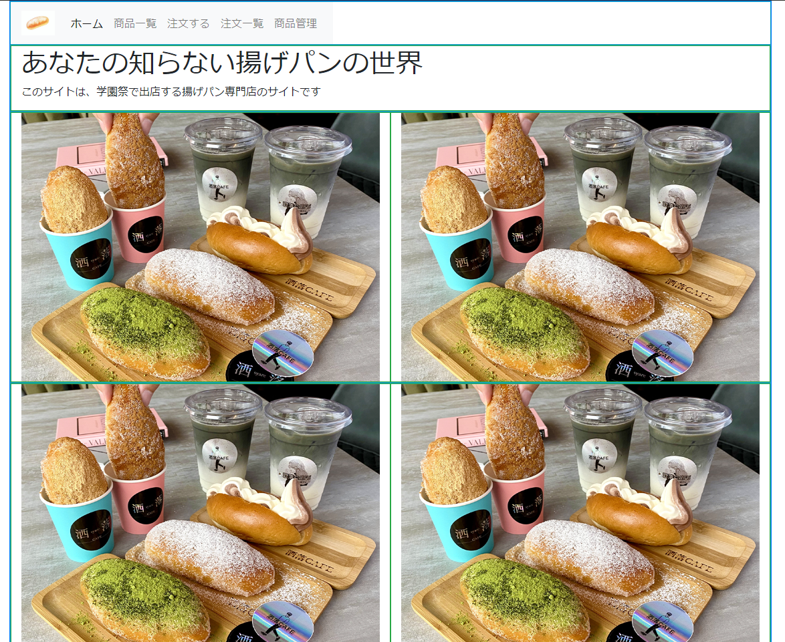

# トップ画面(index.html)
- お客さんが最初に表示する画面    
- 管理用画面(商品情報更新画面、注文情報管理画面)の入口にもなる

## こんな感じのページする予定


## このサイトはbootstrapで作成しています

ひな形
```html
<!DOCTYPE html>
<html>
<head>
    <title>タイトル</title>
    <!-- Bootstrap CSSの読み込み -->
    <link rel="stylesheet" href="https://maxcdn.bootstrapcdn.com/bootstrap/4.5.2/css/bootstrap.min.css">
</head>
<body>

ここにコンテンツを作成

    <!-- Bootstrap JavaScriptの読み込み -->
    <script src="https://maxcdn.bootstrapcdn.com/bootstrap/4.5.2/js/bootstrap.min.js"></script>
</body>
</html>


```

## それでは作成しましょう

- 説明しながら作りますので、一緒に作業してください
- タイピングに集中せず、理解を優先して欲しいです

## なんの店にする？

## bootstrapでレイアウトを決定

## navの作成

## カスタム用スタイルシートの作成(css/style.css)

## スタイルシートの適用

## コンテンツの作成
