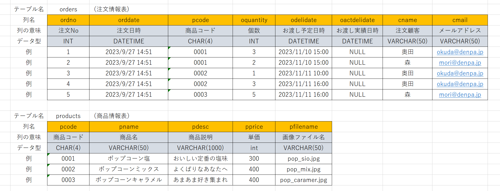

# 提出について
## 毎週金曜日18：00までに以下のものを提出
```
2023mmdd「日付ごとのフォルダ」
  |-kadai02  
 　　 |-index.html
 　　 |-customer  
 　　 |   |-products.php
 　　 |   |-order.php
 　　 |   
 　　 |-images
 　　 |   |-サイトに必要な画像ファイルたち
 　　 |
 　　 |-css
 　　 |   |-style.css
 　　 |
 　　 |-admin
 　　 |   |-shop_products.php
 　　 |   |-shop_orders.php
  　　|
  　　|-作業日報.xlsx(毎授業後に入力しておくこと)
```
## 最終提出 11月〇〇日(金)18:00 までに以下のものを提出

```
kadai02
  |-index.html
  |-customer  
  |   |-products.php
  |   |-order.php
  |   |-images
  |     |-サイトに必要な画像ファイルたち
  |
  |-css
  |   |-style.css
  |
  |-admin
  |   |-shop_products.php
  |   |-shop_orders.php
  |
  |-作業日報.xlsx(作品のアピールシートを入力すること)
```

## 提出について諸注意
- 提出フォルダ「Reports/出席番号/」
-  期限以降は、いかなる理由であろうと受け取りません。
-  最終提出日において、動作しない状態での提出は、再提出となります。
-  提出課題の評価は、作品の他、日報など提出を求められたものを全て評価対象とする
  
<br>

# 課題について
- 学園祭のお店を管理するサイトを作成してください
- 学園祭の商品については自由です。妄想でも構いません。  
- 授業では、プロジェクタで表示しながら一緒に作っていきます。
必要がない人は、自分で先へ先へと作成しても構いません。

## このサイトは以下のファイル群で構成されます
```
kadai02「ルートフォルダ」  
  |-index.html「トップ画面」
  |-customer  
  |   |-products.php「商品紹介画面」  
  |   |-order.php「注文画面」  
  |   |-images「画像用フォルダ」
  |     |-（サイトに必要な画像ファイルたち）
  |
  |-css「スタイルシート用フォルダ」
  |   |-style.css「スタイルシ ート 」
  |
  |-admin「管理画面用フォルダ」  
      |-shop_products.php「商品情報更新画面」
      |-shop_orders.php「注文情報管理画面」
```
---
### トップ画面
- お客さんが最初に表示する画面    
- 管理用画面(商品情報更新画面、注文情報管理画面)の入口にもなる

### 商品紹介画面  
- お客さんが商品一覧を確認する画面

### 注文画面
- お客さんが商品を注文する画面

### 管理用フォルダ
- 管理用フォルダにあるページは、お店側が利用するページを保存する

### 商品情報更新画面
- 商品情報を追加、削除、更新するのに利用する

### 注文情報管理画面
- お客さんからの注文情報を表示する  
- お客さんに商品を渡したら注文情報を表示しないようにする  
---

## データベースについて

- 提出後に先生の環境で動くようにするため、データベースは、以下のように一律で以下のように設計します 
<br>  


### データベース名、ユーザ名、パスワード、テーブル名、列名、データ型などが異なると、動作確認ができないため、再提出となります。

- DB作成手順は、以下の通りです。(ログインが必要な場合は、ユーザ名：root、パスワードは不要でログイン)
1. xammpコントローラから、apacheとmysqlをstartし、しばらく待つ
2. 以下のリンクにアクセス  
http://localhost/phpmyadmin/

1. 新規作成をクリック 
2. データベース名「seminar2db」を入力し、作成ボタンを押下 
3. 左の一覧でseminar2dbが選択されていることを確認して、SQLタブをクリック
4. 以下のSQLをコピペして、実行ボタンを押下
```sql
create table products(
    pcode char(4)  primary key,
    pname varchar(50),
    pdesc varchar(50),
    pprice int,
    pfilename varchar(50)
);

create table orders(
    ordno int primary key,
    orddate datetime,
    pcode char(4) references products(pcode),
    oquantity int,
    odelidate datetime,
    oactdelidate datetime,
    cname varchar(50),
    cmail varchar(50)
);
```

## 余裕がある人に追加課題  
- スタイルシートを作成し、見栄え良くしてください。
- 自由に機能追加について考え、実装してください
- 随時、増えるかもよ
---

## 注意事項
- 必要に応じてJavaScriptを利用しても構いませんが、あくまでも見栄え（フロント部分）にのみ利用可能です。
- データベースへの接続や、タグを吐き出すような処理はすべてPHPに任せてください。
- 追加機能の実装途中などで、動かないものを提出することがないように、随時バックアップを取ってください